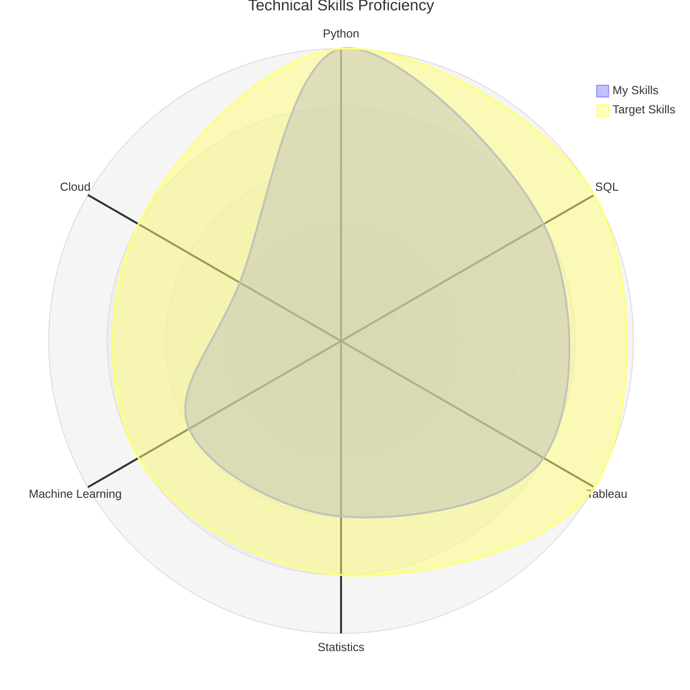
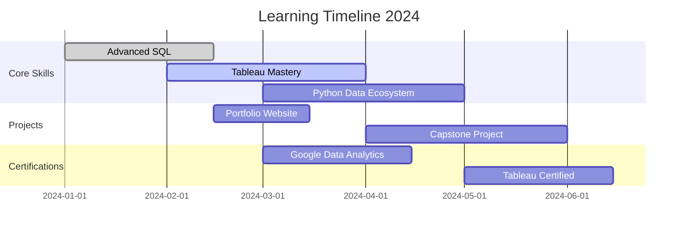

# **🚀 Data Analyst Career Roadmap & Portfolio**


[](https://github.com/BodkeSachin7979)
[](https://linkedin.com/in/sachin-bodke-7a832b1b6)
[](https://sachinbodke.dev)
[](mailto:sachinbodke.dev@gmail.com)

## 📖 About This Repository

Welcome to my comprehensive Data Analytics repository! This isn't just a collection of projects—it's a **complete learning path** and **portfolio showcase** demonstrating the journey to becoming a proficient Data Analyst. Here, you'll find everything from fundamental concepts to advanced analytical techniques.

## 🎯 My Data Analytics Philosophy

<details>
<summary>Business Understanding 🌟</summary>
<ul>
  <li>Problem definition</li>
  <li>Requirement gathering</li>
  <li>Stakeholder analysis</li>
</ul>
</details>

<details>
<summary>Data Collection 📊</summary>
<ul>
  <li>SQL & NoSQL databases</li>
  <li>APIs & Web Scraping</li>
  <li>Surveys & Logs</li>
</ul>
</details>

<details>
<summary>Data Cleaning 🧹</summary>
<ul>
  <li>Missing values handling</li>
  <li>Outlier detection</li>
  <li>Data transformation & normalization</li>
</ul>
</details>

<details>
<summary>Exploratory Analysis 🔍</summary>
<ul>
  <li>Summary statistics</li>
  <li>Correlation & trends</li>
  <li>Feature engineering</li>
</ul>
</details>

<details>
<summary>Statistical Modeling 📈</summary>
<ul>
  <li>Regression / Classification</li>
  <li>Hypothesis testing</li>
  <li>Model evaluation</li>
</ul>
</details>

<details>
<summary>Data Visualization 📊</summary>
<ul>
  <li>Matplotlib / Seaborn</li>
  <li>Plotly / Dash</li>
  <li>Interactive dashboards</li>
</ul>
</details>

<details>
<summary>Storytelling & Insights 💡</summary>
<ul>
  <li>Data storytelling</li>
  <li>Report creation</li>
  <li>Executive summaries</li>
</ul>
</details>

<details>
<summary>Business Impact 🚀</summary>
<ul>
  <li>Decision support</li>
  <li>Strategy optimization</li>
  <li>ROI analysis</li>
</ul>
</details>


## 📚 Learning Path Structure

### 🟢 Foundation Level (Beginner)


| Category | Skills | Projects |
|----------|--------|----------|
| **Programming** | Python Basics, Pandas, NumPy | [Data Cleaning Basics](link) |
| **Databases** | SQL Queries, Joins, Aggregations | [SQL Practice Exercises](link) |
| **Visualization** | Matplotlib, Basic Charts | [Exploratory Data Analysis](link) |
| **Statistics** | Descriptive Statistics, Probability | [Statistical Analysis](link) |

### 🟡 Intermediate Level


| Category | Skills | Projects |
|----------|--------|----------|
| **Advanced SQL** | Window Functions, CTEs, Optimization | [Advanced SQL Queries](link) |
| **BI Tools** | Tableau, Power BI, Looker | [Dashboard Projects](link) |
| **Data Wrangling** | API Integration, Web Scraping | [Data Collection Projects](link) |
| **Statistical Testing** | Hypothesis Testing, A/B Testing | [Experiment Analysis](link) |

### 🔴 Advanced Level


| Category | Skills | Projects |
|----------|--------|----------|
| **Machine Learning** | Predictive Modeling, Clustering | [ML Projects](link) |
| **Big Data** | Spark, Hadoop, Cloud Platforms | [Big Data Projects](link) |
| **Advanced Viz** | D3.js, Interactive Dashboards | [Advanced Visualization](link) |
| **Deployment** | Docker, Cloud Deployment, APIs | [Production Projects](link) |

## 🛠️ Technical Skills Matrix



## 📂 Repository Organization

```
Data-Analyst-Roadmap/
│
├── 📂 01-foundations/
│   ├── python-basics/
│   ├── sql-fundamentals/
│   ├── statistics-101/
│   └── excel-for-analysis/
│
├── 📂 02-intermediate/
│   ├── data-visualization/
│   ├── database-design/
│   ├── business-intelligence/
│   └── data-wrangling/
│
├── 📂 03-advanced/
│   ├── machine-learning/
│   ├── big-data/
│   ├── advanced-sql/
│   └── deployment/
│
├── 📂 04-real-projects/
│   ├── customer-analytics/
│   ├── financial-analysis/
│   ├── marketing-analytics/
│   └── operations-analytics/
│
├── 📂 05-certifications/
│   ├── google-data-analytics/
│   ├── microsoft-certified/
│   └── tableau-certified/
│
├── 📂 resources/
│   ├── learning-materials/
│   ├── cheat-sheets/
│   ├── datasets/
│   └── templates/
│
└── 📂 tools-setup/
    ├── environment-setup/
    ├── docker-configs/
    └── cloud-setup/
```

## 🎓 Learning Roadmap
### Phase 0: creating conda enviroment for Data Analyst


A ready-to-use **Conda environment for Data Analysis** with all essential Python libraries for data cleaning, visualization, statistical analysis, and basic machine learning. Perfect for any Data Analyst project.

---

## **Environment Name**

`env_name` (short, professional, and easy to remember)

---

## **Key Features**

* Data handling: `pandas`, `numpy`, `scipy`
* Visualization: `matplotlib`, `seaborn`, `plotly`
* Machine Learning: `scikit-learn`, `xgboost`, `lightgbm`, `statsmodels`
* Database & API: `sqlalchemy`, `mysql-connector-python`, `psycopg2`, `requests`, `beautifulsoup4`
* Productivity: `jupyterlab`, `notebook`, `ipython`, `nbconvert`
* Optional: `tensorflow`, `torch`, `pandas-profiling`, `sweetviz`

---

## **Installation**

1. **Create the environment**

```bash
conda env create -f data_analyst_env.yml
```

2. **Activate the environment**

```bash
conda activate da-env
```

3. **Start Jupyter Lab**

```bash
jupyter lab
```

---

## **Usage**

Use this environment for:

* Data cleaning & manipulation
* Exploratory Data Analysis (EDA)
* Visualization & reporting
* Building machine learning models
* Database interactions & web scraping

---

### Phase 1: Foundation Building (Months 1-3)


- [x] **Python Programming Fundamentals**
- [x] **SQL Database Queries**
- [x] **Basic Statistics and Mathematics**
- [x] **Data Cleaning Techniques**
- [ ] **Excel for Data Analysis**

### Phase 2: Core Analytics (Months 4-6)


- [ ] **Data Visualization with Tableau/Power BI**
- [ ] **Exploratory Data Analysis (EDA)**
- [ ] **Statistical Hypothesis Testing**
- [ ] **Dashboard Creation**
- [ ] **Business Metrics Understanding**

### Phase 3: Advanced Techniques (Months 7-9)


- [ ] **Predictive Modeling**
- [ ] **A/B Testing and Experimentation**
- [ ] **Advanced SQL (Window Functions, CTEs)**
- [ ] **Data Storytelling**
- [ ] **API Integration**

### Phase 4: Specialization & Real Projects (Months 10-12)


- [ ] **Domain Specialization (Marketing/Finance/etc.)**
- [ ] **Portfolio Project Completion**
- [ ] **Cloud Platforms (AWS/GCP/Azure)**
- [ ] **Big Data Tools Introduction**
- [ ] **Interview Preparation**

## 🌟 Featured Projects

### 🏆 End-to-End Business Analysis


| Project | Domain | Skills Demonstrated | Status |
|---------|--------|---------------------|--------|
| **[E-commerce Analytics](link)** | Retail | SQL, Python, Tableau, Forecasting | ✅ Complete |
| **[Customer Churn Prediction](link)** | Telecom | ML, Statistics, Business Insights | ✅ Complete |
| **[Financial Market Analysis](link)** | Finance | Time Series, Risk Analysis, Viz | 🚧 In Progress |
| **[Healthcare Analytics](link)** | Healthcare | Data Ethics, Statistical Modeling | 📋 Planned |

### 🔬 Technical Deep Dives


| Project | Focus Area | Technologies |
|---------|------------|--------------|
| **Real-time Data Pipeline** | Data Engineering | Python, Kafka, Spark |
| **ML Model Deployment** | MLOps | Flask, Docker, AWS |
| **Interactive Dashboard** | Visualization | Tableau, D3.js |
| **Database Optimization** | Performance | SQL, Indexing, Query Tuning |

## 📊 My Analytics Toolkit

### Programming & Databases
```python
# My Core Technical Stack
tech_stack = {
    "languages": ["Python", "SQL", "R", "JavaScript"],
    "databases": ["PostgreSQL", "MySQL", "SQLite", "MongoDB"],
    "libraries": ["Pandas", "NumPy", "Scikit-learn", "Matplotlib", "Seaborn"],
    "tools": ["Jupyter", "VS Code", "Git", "Docker"]
}
```

### Business Intelligence & Visualization


| Tool | Proficiency | Use Case |
|------|-------------|----------|
| **Tableau** | Advanced | Interactive Dashboards |
| **Power BI** | Intermediate | Business Reporting |
| **Looker** | Beginner | Enterprise Analytics |
| **Google Data Studio** | Intermediate | Marketing Analytics |

### Cloud & Big Data


- **AWS:** S3, Redshift, QuickSight
- **Google Cloud:** BigQuery, Data Studio
- **Microsoft Azure:** Synapse Analytics, Power BI
- **Big Data:** Spark, Hadoop, Kafka

## 📈 Progress Tracking

### Current Learning Goals


### Skills Progress
| Skill | Current Level | Target Level | Progress |
|-------|---------------|--------------|----------|
| **Python** | Advanced | Expert | 🟢🟢🟢🟢⚪ |
| **SQL** | Advanced | Expert | 🟢🟢🟢🟢⚪ |
| **Tableau** | Intermediate | Advanced | 🟢🟢🟢⚪⚪ |
| **Statistics** | Intermediate | Advanced | 🟢🟢🟢⚪⚪ |
| **Machine Learning** | Beginner | Intermediate | 🟢🟢⚪⚪⚪ |

## 🤝 Contribution Guidelines


This repository is open for collaboration! Here's how you can contribute:

### Ways to Contribute:
1. **Add New Learning Materials** - Share useful resources
2. **Improve Documentation** - Enhance explanations and guides
3. **Create New Projects** - Add diverse analytical projects
4. **Fix Issues** - Help improve code and content
5. **Share Insights** - Add your learning experiences

### Getting Started:
```bash
# Fork the repository
git clone https://github.com/your-username/data-analyst-roadmap.git
cd data-analyst-roadmap

# Create a new branch
git checkout -b feature/your-contribution

# Make your changes and commit
git commit -m "Add your meaningful message"

# Push and create Pull Request
git push origin feature/your-contribution
```

## 📚 Learning Resources

### Recommended Path


#### Free Resources
- [Kaggle Learn](https://www.kaggle.com/learn) - Interactive courses
- [Mode SQL Tutorial](https://mode.com/sql-tutorial/) - SQL fundamentals
- [Google Data Analytics Certificate](https://grow.google/certificates/data-analytics/) - Professional certificate

#### Paid Courses
- [DataCamp](https://www.datacamp.com) - Comprehensive learning platform
- [Coursera Specializations](https://www.coursera.org) - University-level courses
- [Udemy Data Science](https://www.udemy.com) - Practical project-based courses

#### Books
- "Storytelling with Data" by Cole Nussbaumer Knaflic
- "Python for Data Analysis" by Wes McKinney
- "Practical Statistics for Data Scientists"

## 🏆 Certifications & Achievements

| Certification | Provider | Status | Date |
|---------------|----------|--------|------|
| Google Data Analytics Professional Certificate | Coursera | ✅ Completed | 2024 |
| Tableau Desktop Specialist | Tableau | 🎯 In Progress | 2024 |
| SQL Advanced Certification | HackerRank | ✅ Completed | 2023 |
| Python for Data Science | DataCamp | ✅ Completed | 2023 |


### 🌐 Professional Profiles
- **LinkedIn:** [Your LinkedIn](https://linkedin.com/in/yourprofile)
- **Portfolio:** [Your Website](https://yourportfolio.com)
- **Kaggle:** [Your Kaggle](https://kaggle.com/yourprofile)
- **Tableau Public:** [Your Viz](https://public.tableau.com/app/profile/yourprofile)

### 💌 Direct Contact
- **Email:** [your.email@domain.com](sachinbodke.dev@gmail.com)

### 📊 My Data Journey Blog
I regularly write about my learning journey, project experiences, and insights in data analytics. Check out my latest articles on [Medium/YourBlog](link).

---

## ⭐ Support This Repository

If you find this roadmap helpful, please consider giving it a star! ⭐
